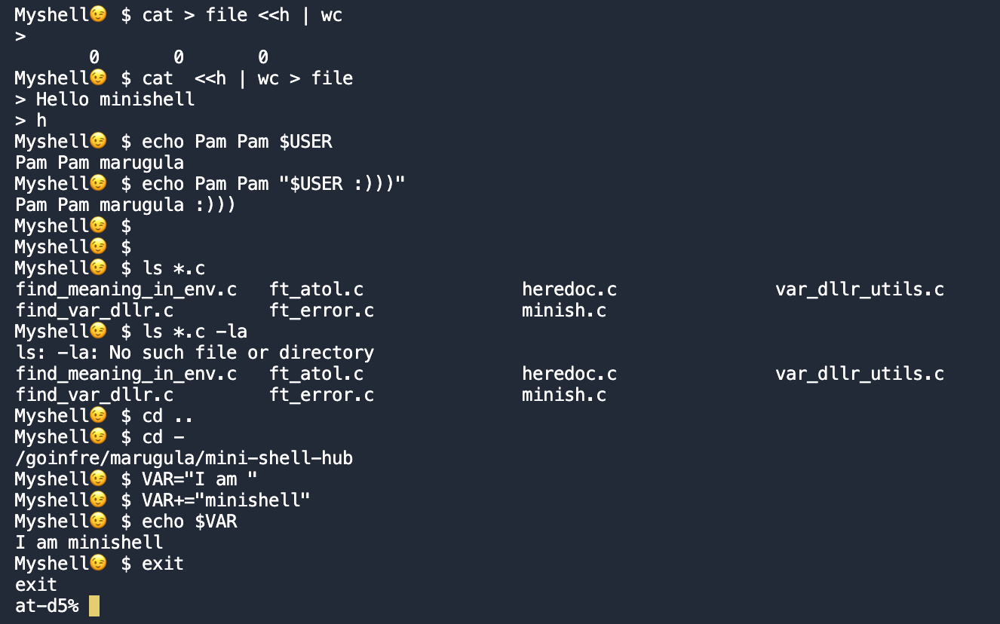

# Mini-Shell
### A training project that repeats the basic functionality of the interactive mode of the bash shell

---



## How to use it?

Use ``make`` to build the project
(_you must have the readline library installed_)

And simply run it with:
```
./minishell
```

## Available functionality:

* You can execute programs on absolute and relative paths, as well as on the path to the environment (_`bin/cat`_,_` cat`_) along with arguments

* You can use __``<``__, __`` >>``__, __``>``__ to redirect input from file _(``< infile``)_ or output in file (_``"> outfile"``_ or _``">> outfile"``_)

* You can use ``pipe`` (__``"|"``__) like in bash

* You can use __``$``__ to dereference variables _(``$USER`` will be replaced with ``"username"``)_

* With __``=``__ you can creat new variable _(``VAR="new var"``)_, and with the __`export`__ command, you can add a new variable to the environment _(``export VAR `` or `` export VAR2="second var" ``)_

* You can use __`` ` ``__ and __``"``__ like in bash, combining them as you see fit

* You can use Wildcards __``*``__ to search for the required set of files _(``*.c`` , `` objs/*.o``)_

* The return code of the last program can be checked using __``$?``__

* Signals are also processed:
  * __``Ctrl-C``__ is ignored and moves the carriage to a new line
  * __``Ctrl-\``__ is completely ignored
  * __``Ctrl-D``__ to exit the minishell

* You can combine all this __``^^^``__ functionality as you need

